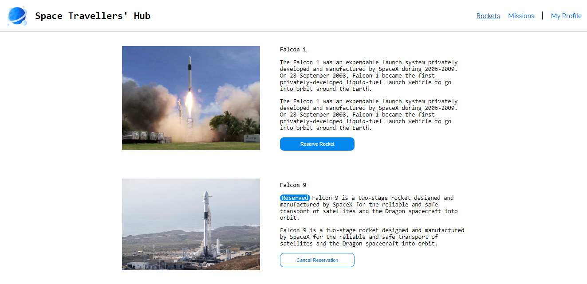
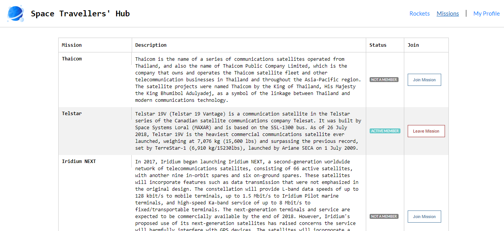
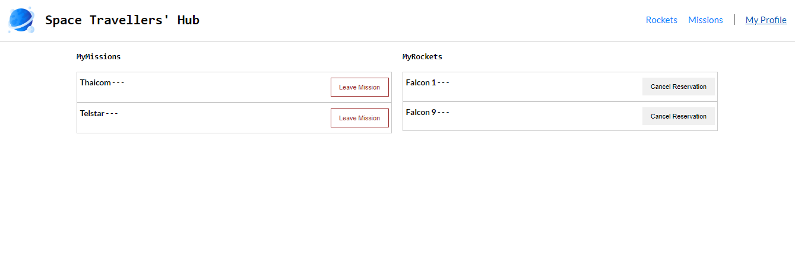

# Space Travelers' Hub

> This is a React app working with the real live data from the SpaceX API. The application will allow users to book rockets and join selected space missions.

The Rockets section displays a list of all available SpaceX rockets. Users can book each rocket by clicking the reservation button or cancel the previously made booking. The Missions section displays a list of current missions along with their brief description and participation status. There is also a button next to each mission that allows users to join the selected mission or leave the mission the user joined earlier.

## Built With

- Major languages: HTML CSS & JavaScript
- Framework(Library): React & Redux

## Live Demo

([Netlify Live Demo](https://62b45e8d1cd8b21af3e0e814--stunning-khapse-f798f8.netlify.app/))

## Getting Started

- To get a local copy up and running follow these simple example steps.

# Setup

- git clone https://github.com/NabilHY/space-hub.git

### Prerequisites

- Have a working and updated browser.
- Have a local version control like **git** install on your computer.
- Have an account and sign in on GitHub, as online/remote version control system.
- Download waves to check project accessibilty.

### Install

- Lighthouse (An open-source, automated tool for improving the quality of web pages. It has audits for performance, accessibility, progressive web apps, SEO and more).

- Webhint (A customizable linting tool that helps you improve your site's accessibility, speed, cross-browser compatibility, and more by checking your code for best practices and common errors).

- Stylelint (A mighty, modern linter that helps you avoid errors and enforce conventions in your styles).

- ESlint (A mighty, modern linter that helps you avoid errors and enforce conventions in JavaScript codes)

### Create React App

- npx create-react-app my-app
- npm install redux react-redux
- cd my-app
- npm run start

### Run tests

- **npx hint .** : To test html codes
- **npx stylelint "**/\*.{css,scss}"\*\* : To test css code
- **npx eslint .** : To test Eslint Report
- **npm run test** : To run the tests.

### Deployment

- Go to settings
- Click on pages
- Choose your source
- Choose folder
- choose a theme(optional)
- Enforce HTTPS
- And then save

## Authors

👤 **Pedro Marques**

- GitHub: https://github.com/ppmarq1
- Twitter: https://twitter.com/ppmarq1
- LinkedIn: https://br.linkedin.com/in/pedroalmeidamarques/

**NabilHY**

- GitHub: https://github.com/NabilHY
- Twitter: https://twitter.com/NeoNabil2
- LinkedIn: https://www.linkedin.com/in/nabil-hayoun/

## 🤝 Contributing

Contributions, issues, and feature requests are welcome!

Feel free to check the [issues page](https://github.com/NabilHY/space-hub/issues).

## Show your support

Give a ⭐️ if you like this project!

## 📝 License

This project is [MIT](./MIT.md) licensed.
